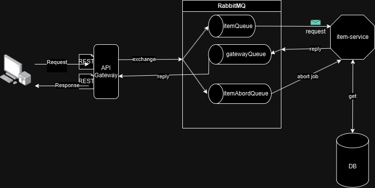

## Spring AMQP Request/Reply Pattern Example

This is a simple example of the Spring AMQP Request/Reply pattern,
which let the downstream service respond to the request in a asynchronous manner.

## Overview
This example demonstrates how to implement a Request/Reply pattern
using Spring AMQP with RabbitMQ. The system consists of:

* API Gateway: Sends requests to RabbitMQ and waits for responses asynchronously.
* Item Service: Listens for requests, processes them, and sends responses back.
* RabbitMQ: Acts as the message broker, handling communication between services.
  This setup allows decoupling between services while ensuring non-blocking request handling. However, it does not use
  Reactive programming (such as Project Reactor), meaning there is no built-in backpressure handling.

NB! In order for testing, configured the Gateway to use only one thread.
And simulating heavy task by creating a delay in item-service.

## Prerequisites

* Jdk 17+
* Gradle 8.14+
* Docker
* Docker Compose

## Build and Run

### 1. Build JARs

#### 1.a Linux or Windows w/ GitBash/WSL

```bash
./gradlew clean bootAll
```

#### 1.b Windows (with CMD or PowerShell)

```bash
gradlew.bat clean bootAll
```

### 2. Run

```bash
docker-compose up --build
```

## Architecture



### Reply To

In the header of the message, adding additional header, which is the replyTo.
Consist of :

1. Expecting reply to exchange
2. Expecting reply to routing key

Inform of String:
\[\<exchange\>:\]\<routing key\>

Example:
1. gatewayQueue:gateway.reply.http-request
2. item.reply.http-request (using defauflt exchange )

### API Gateway:

When a request arrived,generate a UUID (correlationID) and map to a Sink (i.e., controllerStore) make request handler
asynchronous.
Perform a publish to RabbitMQ with requested data, (in this case nothing).
Performing response, when the controllerStore is feed with data.
And setting timeout action.
If timeout, and response has not been triggered by the sink, throw Timeout exception
(let the ControllerAdvice handle exception) and publish another message to RabbitMQ, with the generated correlation ID (
to abortQueue).
### Item Service:
#### itemQueue:
When a there is a message, perform the (heavy) job (in this case fetching data).
Once data is processed, send back to the RabbitMQ with [replyTo](#reply-to) and correlationID.
#### itemAbortQueue:
Extracting the correlation ID, and try to abort the task.
## Notes:
This example project is fully ASYNCHRONOUS, but is no REACTIVE (backpressure).
## Future Improvements
### Reactive (2025-03-28):
* Use Project Reactor to handle backpressure.
* Adding Redis to manage the state of downstream services.
* When the worker threads are too big, update the state into Redis.
* At gateway, instead of alway delegating to downstream service, check the state of downstream service upfront.
If it is full, then reject the request.
